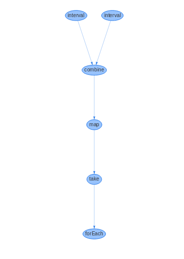

# Static graph renderer for tallbags

## Proof of concept

Use this sink as a replacement for `forEach`, and it will automatically dump a graph visualization on the DOM. Hacky implementation.

## Example use

[Try it out in a CodeSandbox](https://codesandbox.io/embed/10zvmlxjo7)

```js
const forEach = require('tallbag-for-each-poc-static-graph');

pipe(
  combine(interval(1000), interval(1500)),
  map(([x, y]) => `a${x} b${y}`),
  take(5),
  forEach(console.log)
);
```



